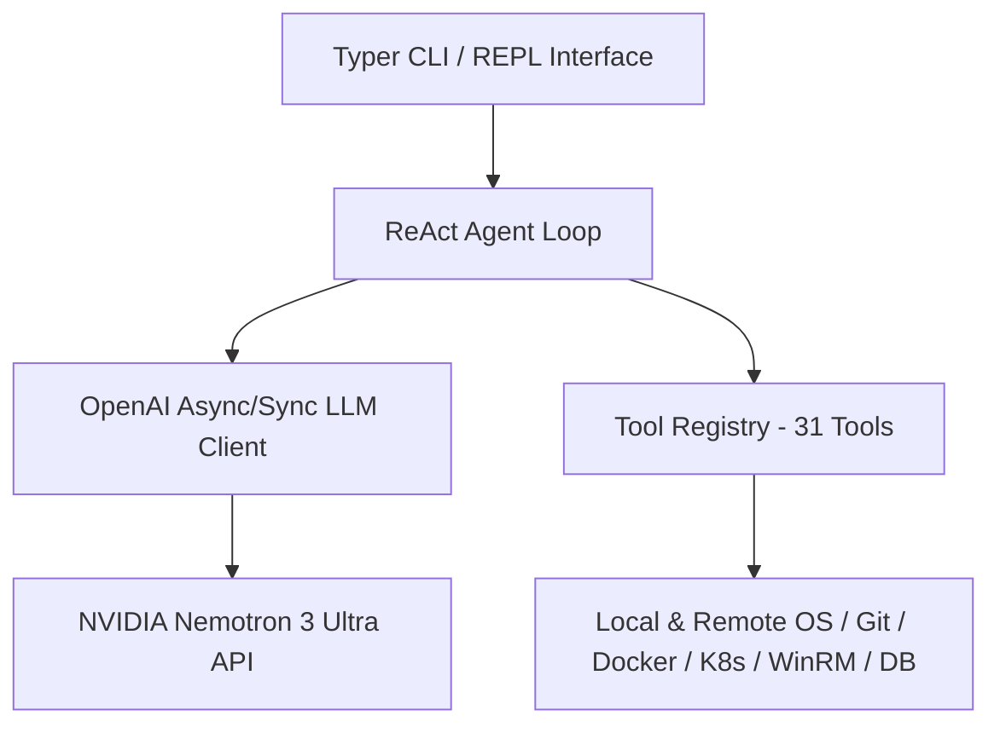

# AI Agent - AI SysAdmin & DevSecOps Agent

[](https://www.python.org/downloads/)
[](https://github.com/astral-sh/ruff)
[](https://mypy-lang.org/)
[](https://www.docker.com/)

**AI Agent**, **NVIDIA Nemotron 3 Ultra** (OpenAI Uyumlu API) altyapısını kullanan, **31 adet tam yetkili araca** sahip, modüler, tip-güvenli, streaming + reasoning destekli **Otonom AI Sistem Yöneticisi ve DevSecOps Ajanıdır**.

---

## 🏛️ Mimari Yapı



```
ai-agent/
├─ .gitignore
├─ .env.example
├─ .env
├─ pyproject.toml
├─ requirements.txt
├─ requirements-dev.txt
├─ Dockerfile
├─ docker-compose.yml
├─ README.md
├─ Makefile
├─ main.py                           # Hızlı başlatma girişi
├─ src/
│  └─ ai_agent/
│     ├─ config.py                   # Pydantic Settings & Env okuyucu
│     ├─ logging_conf.py             # Structlog + Rich yapılandırması
│     ├─ exceptions.py               # Özel hata hiyerarşisi
│     ├─ models/                     # ChatMessage, ToolCall, ToolResult modelleri
│     ├─ tools/                      # 31 Adet tam yetkili araç modülü
│     ├─ core/                       # LLM Client, Agent Loop, System Prompt & Security Guard
│     └─ cli/                        # Rich REPL & Typer CLI komutları
└─ tests/                            # Unit & Integration test suite
```

---

## ⚙️ Kurulum ve Çalıştırma

### 1. Sanal Ortam Oluşturma ve Bağımlılıkları Yükleme
```bash
python -m venv venv
# Windows için:
.\venv\Scripts\activate
# Linux/Mac için:
source venv/bin/activate

pip install -e .[dev]
```

### 2. Çevre Değişkenleri (.env)
`.env.example` dosyasını `.env` olarak kopyalayın ve NVIDIA API Key bilgilerinizi girin:
```bash
cp .env.example .env
```

### 3. Ajanı Çalıştırma
İnteraktif REPL Sohbet Modu:
```bash
python main.py
# veya CLI üzerinden:
ai-agent chat
```

Tek Komut Çalıştırma:
```bash
ai-agent run "Git durumunu kontrol et ve proje bağımlılıklarını analiz et"
```

Sistem Sağlık Kontrolü (Doctor):
```bash
ai-agent doctor
```

---

## 🛠 31 Araç Kataloğu

| Kategori | Araç Adı | Açıklama |
|---|---|---|
| **Dosya & Kod (10)** | `write_file`, `read_file`, `list_directory`, `copy_move_delete`, `search_files`, `code_edit`, `patch_apply`, `symbol_search`, `code_format`, `file_watch` | Atomik dosya işlemleri, patch uygulama, sembol arama ve otomatik formatlama. |
| **Yazılım & Git (4)** | `git_manage`, `project_analyze`, `test_runner`, `lsp_query` | Git versiyon kontrolü, proje yapısı analizi, test runner ve Linter/LSP sorguları. |
| **Konteyner & K8s (2)** | `docker_manage`, `k8s_manage` | Docker & Docker Compose yönetimi, Kubernetes `kubectl` pod/log işlemleri. |
| **Sistem & Süreç (4)** | `execute_command`, `get_process_list`, `kill_process`, `manage_service` | Shell komutu çalıştırma, süreç yönetimi ve yerel/uzak servis denetimi. |
| **Uzak Yönetim (5)** | `invoke_remote_command`, `create_pssession`, `copy_to_remote`, `copy_from_remote`, `test_connection` | WinRM/SSH üzerinden uzakta kimlik doğrulamalı komut çalıştırma ve dosya transferi. |
| **Windows İleri (4)** | `registry_read_write`, `wmi_query`, `event_log_query`, `scheduled_task_manage` | Registry okuma/yazma, WMI sorguları, EventLog filtreleme ve Task Scheduler yönetimi. |
| **Ağ & DB (2)** | `http_request`, `db_query` | REST API çağrıları (HTTP) ve SQLite veritabanı sorguları. |

---

## 🔒 Güvenlik (Security Guardrails)

- **Path Traversal Guard**: `resolve_safe_path()` sayesinde izin verilmeyen üst dizinlere izinsiz erişim engellenir.
- **Command Whitelist**: Yalnızca onaylı shell ve aracı komutlar çalıştırılır.
- **Secret Scrubbing**: API anahtarları ve şifreler log çıktılarından otomatik olarak maskelenir (`***REDACTED***`).

---

## 🐳 Docker İle Çalıştırma

```bash
docker build -t ai-agent .
docker run --rm -it --env-file .env ai-agent
```
